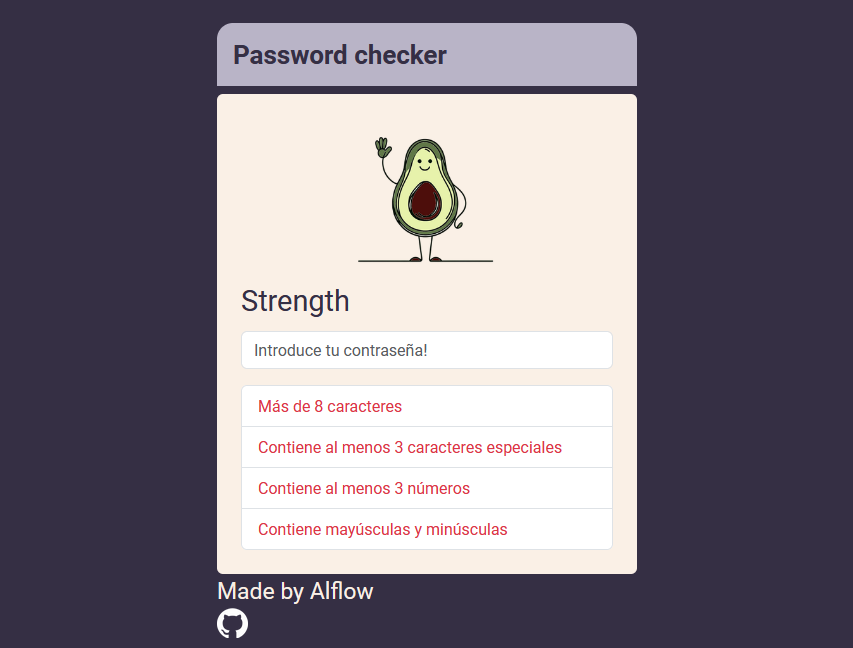

# passStrenghtChecker
Componente sencillo que combina vanilla JS, Bootstrap, y CSS.

## Comprobaciones:

    Más de 8 caracteres
    Contiene al menos 3 caracteres especiales
    Contiene al menos 3 números
    Contiene mayúsculas y minúsculas

